# Marquez Data Model

> **Last updated:** 2026-06-29 — verified against Flyway migration **V107** (`create_lineage_edges_and_partition_run_facets`).
> This document is maintained by the Technical Writer agent. After any Flyway migration, run
> `bmad/agents/technical-writer-agent.md` → "Audit Migration" to update this file.

---

## Entity Relationship Diagram

```mermaid
erDiagram
    %% ── Core ──────────────────────────────────────────
    NAMESPACES ||--o{ NAMESPACE_OWNERSHIPS : has
    OWNERS     ||--o{ NAMESPACE_OWNERSHIPS : has
    NAMESPACES ||--o{ DATASETS             : contains
    NAMESPACES ||--o{ JOBS                 : contains
    SOURCES    ||--o{ DATASETS             : provides

    %% ── Dataset graph ─────────────────────────────────
    DATASETS ||--o{ DATASET_VERSIONS               : has
    DATASETS ||--o{ DATASET_FIELDS                 : has
    DATASETS ||--o{ DATASET_FACETS                 : has
    DATASETS ||--o{ DATASET_SCHEMA_VERSIONS         : has
    DATASETS ||--o{ DATASETS_TAG_MAPPING            : tagged_by
    DATASETS ||--o{ DATASET_SYMLINKS                : aliased_as
    TAGS     ||--o{ DATASETS_TAG_MAPPING            : tags
    TAGS     ||--o{ DATASET_FIELDS_TAG_MAPPING      : tags
    TAGS     ||--o{ JOBS_TAG_MAPPING                : tags

    DATASET_FIELDS   ||--o{ DATASET_VERSIONS_FIELD_MAPPING        : mapped_in
    DATASET_FIELDS   ||--o{ DATASET_FIELDS_TAG_MAPPING            : has
    DATASET_FIELDS   ||--o{ COLUMN_LINEAGE                        : output_field
    DATASET_FIELDS   ||--o{ COLUMN_LINEAGE                        : input_field
    DATASET_VERSIONS ||--o{ DATASET_VERSIONS_FIELD_MAPPING        : contains
    DATASET_VERSIONS ||--o{ COLUMN_LINEAGE                        : output_version
    DATASET_VERSIONS ||--o{ COLUMN_LINEAGE                        : input_version
    DATASET_SCHEMA_VERSIONS ||--o{ DATASET_SCHEMA_VERSIONS_FIELD_MAPPING : contains
    DATASET_FIELDS          ||--o{ DATASET_SCHEMA_VERSIONS_FIELD_MAPPING : mapped_in

    %% ── Job graph ─────────────────────────────────────
    JOBS         ||--o{ JOB_VERSIONS          : has
    JOBS         ||--o{ JOB_FACETS            : has
    JOBS         ||--o{ JOBS_TAG_MAPPING      : tagged_by
    JOB_VERSIONS ||--o{ JOB_VERSIONS_IO_MAPPING : maps
    JOB_VERSIONS ||--o{ RUNS                  : executes
    JOB_VERSIONS ||--o{ JOB_FACETS            : has
    DATASETS     ||--o{ JOB_VERSIONS_IO_MAPPING : participates_in

    %% ── Run graph ─────────────────────────────────────
    RUNS     ||--o{ RUN_STATES    : transitions
    RUNS     ||--o{ RUN_FACETS    : has
    RUNS     ||--o{ DATASET_VERSIONS : creates
    RUN_ARGS ||--o{ RUNS          : parameterises

    %% ── Lineage events ────────────────────────────────
    LINEAGE_EVENTS ||--o{ DATASET_FACETS : triggers
    LINEAGE_EVENTS ||--o{ JOB_FACETS     : triggers
    LINEAGE_EVENTS ||--o{ RUN_FACETS     : triggers

    %% ── Schema (abbreviated for readability) ──────────
    NAMESPACES {
        UUID        uuid           PK
        TIMESTAMPTZ created_at
        TIMESTAMPTZ updated_at
        VARCHAR     name           UK
        TEXT        description
        VARCHAR     current_owner_name
        BOOLEAN     is_hidden      "DEFAULT FALSE (V53)"
    }

    OWNERS {
        UUID        uuid       PK
        TIMESTAMPTZ created_at
        VARCHAR     name       UK
    }

    NAMESPACE_OWNERSHIPS {
        UUID        uuid           PK
        TIMESTAMPTZ started_at
        TIMESTAMPTZ ended_at
        UUID        namespace_uuid FK
        UUID        owner_uuid     FK
    }

    SOURCES {
        UUID        uuid           PK
        VARCHAR(64) type           "NOT NULL"
        TIMESTAMPTZ created_at
        TIMESTAMPTZ updated_at
        VARCHAR     name           UK
        VARCHAR(255) connection_url
        TEXT        description
    }

    DATASETS {
        UUID        uuid              PK
        VARCHAR(64) type              "NOT NULL"
        TIMESTAMPTZ created_at
        TIMESTAMPTZ updated_at
        UUID        namespace_uuid    FK
        UUID        source_uuid       FK
        VARCHAR(255) name
        VARCHAR(255) physical_name
        TEXT        description
        UUID        current_version_uuid
        VARCHAR     namespace_name    "DENORM"
        VARCHAR     source_name       "DENORM"
        BOOLEAN     is_hidden         "DEFAULT FALSE (V46)"
        BOOLEAN     is_deleted        "DEFAULT FALSE (V41)"
    }

    DATASET_FIELDS {
        UUID        uuid           PK
        UUID        dataset_uuid   FK
        VARCHAR(64) type           "NOT NULL"
        TIMESTAMPTZ created_at
        TIMESTAMPTZ updated_at
        VARCHAR(255) name
        TEXT        description
    }

    DATASET_FIELDS_TAG_MAPPING {
        UUID dataset_field_uuid FK
        UUID tag_uuid           FK
    }

    DATASET_VERSIONS {
        UUID        uuid                       PK
        UUID        dataset_uuid               FK
        TIMESTAMPTZ created_at
        UUID        version                    "NOT NULL"
        UUID        run_uuid                   FK
        JSONB       fields                     "DENORM (V29)"
        VARCHAR(255) namespace_name            "DENORM (V29)"
        VARCHAR(255) dataset_name              "DENORM (V29)"
        VARCHAR(63)  lifecycle_state           "(V41)"
        UUID        dataset_schema_version_uuid FK "(V69.3)"
    }

    DATASET_VERSIONS_FIELD_MAPPING {
        UUID dataset_version_uuid FK
        UUID dataset_field_uuid   FK
    }

    DATASET_SCHEMA_VERSIONS {
        UUID        uuid         PK
        UUID        dataset_uuid FK
        TIMESTAMPTZ created_at
    }

    DATASET_SCHEMA_VERSIONS_FIELD_MAPPING {
        UUID dataset_schema_version_uuid FK
        UUID dataset_field_uuid          FK
    }

    DATASET_SYMLINKS {
        UUID        dataset_uuid   FK
        VARCHAR     name           "NOT NULL"
        UUID        namespace_uuid FK
        VARCHAR(64) type
        BOOLEAN     is_primary     "DEFAULT FALSE"
        TIMESTAMPTZ created_at
        TIMESTAMPTZ updated_at
    }

    DATASETS_TAG_MAPPING {
        UUID        dataset_uuid FK
        UUID        tag_uuid     FK
        TIMESTAMPTZ tagged_at    "NOT NULL"
    }

    TAGS {
        UUID        uuid        PK
        TIMESTAMPTZ created_at
        TIMESTAMPTZ updated_at
        VARCHAR(255) name       UK "NOT NULL"
        TEXT        description
    }

    JOBS {
        UUID        uuid                    PK
        VARCHAR(64) type                    "NOT NULL"
        TIMESTAMPTZ created_at
        TIMESTAMPTZ updated_at
        UUID        namespace_uuid          FK
        VARCHAR(255) name                   "NOT NULL"
        TEXT        description
        UUID        current_version_uuid
        VARCHAR(255) namespace_name         "DENORM (V21)"
        UUID        current_job_context_uuid "(V24)"
        VARCHAR     current_location        "DENORM (V24)"
        JSONB       current_inputs          "DENORM (V24)"
        JSONB       current_outputs         "DENORM (V24)"
        UUID        parent_job_uuid         FK "(V43)"
        BOOLEAN     is_hidden               "DEFAULT FALSE (V46)"
        UUID        symlink_target_uuid     FK "(V42)"
        UUID        current_run_uuid        "(V74)"
    }

    JOB_VERSIONS {
        UUID        uuid           PK
        UUID        job_uuid       FK
        TIMESTAMPTZ created_at
        TIMESTAMPTZ updated_at
        UUID        version        "NOT NULL"
        VARCHAR(255) location      "NOT NULL"
        UUID        latest_run_uuid
        UUID        namespace_uuid "DENORM (V22)"
        VARCHAR(255) namespace_name "DENORM (V22)"
        VARCHAR(255) job_name      "DENORM (V22)"
    }

    JOB_VERSIONS_IO_MAPPING {
        UUID        job_version_uuid         FK
        UUID        dataset_uuid             FK
        VARCHAR(64) io_type                  "NOT NULL"
        UUID        job_uuid                 FK "(V67.1)"
        UUID        job_symlink_target_uuid  FK "(V67.1)"
        BOOLEAN     is_current_job_version   "DEFAULT FALSE (V67.1)"
        TIMESTAMP   made_current_at          "(V67.1)"
    }

    JOBS_TAG_MAPPING {
        UUID        job_uuid  FK
        UUID        tag_uuid  FK
        TIMESTAMPTZ tagged_at "NOT NULL"
    }

    RUN_ARGS {
        UUID        uuid      PK
        TIMESTAMPTZ created_at
        TEXT        args       "NOT VARCHAR(255) — changed V7"
        VARCHAR(255) checksum  UK
    }

    RUNS {
        UUID        uuid                 PK
        UUID        job_version_uuid     FK
        UUID        run_args_uuid        FK
        TIMESTAMPTZ created_at
        TIMESTAMPTZ updated_at
        TIMESTAMPTZ nominal_start_time
        TIMESTAMPTZ nominal_end_time
        VARCHAR(64) current_run_state
        VARCHAR     namespace_name       "DENORM (V23)"
        VARCHAR     job_name             "DENORM (V23)"
        VARCHAR     location             "DENORM (V23)"
        TIMESTAMPTZ transitioned_at      "DENORM (V23; TIMESTAMPTZ since V73)"
        TIMESTAMPTZ started_at           "DENORM (V23)"
        TIMESTAMPTZ ended_at             "DENORM (V23)"
        VARCHAR(255) external_id         "(V19)"
        UUID        job_context_uuid     "(V27)"
        UUID        parent_run_uuid      FK "(V43)"
    }

    RUN_STATES {
        UUID        uuid           PK
        UUID        run_uuid       FK
        TIMESTAMPTZ transitioned_at "NOT NULL"
        VARCHAR(64) state          "NOT NULL"
    }

    LINEAGE_EVENTS {
        TIMESTAMPTZ event_time     "NOT NULL"
        JSONB       event          "NOT NULL"
        VARCHAR(64) event_type
        VARCHAR(64) _event_type    "DEFAULT RUN_EVENT (V66.2)"
        UUID        run_uuid       "FK runs.uuid (V33; run_id TEXT dropped V36)"
        TIMESTAMPTZ created_at     "(added V54)"
        VARCHAR     job_name
        VARCHAR     job_namespace
        VARCHAR     producer
        DATE        run_date       "(V101 — partition key)"
    }

    COLUMN_LINEAGE {
        UUID        output_dataset_version_uuid FK
        UUID        output_dataset_field_uuid   FK
        UUID        input_dataset_version_uuid  FK
        UUID        input_dataset_field_uuid    FK
        TEXT        transformation_description
        VARCHAR(255) transformation_type
        TIMESTAMPTZ created_at
        TIMESTAMPTZ updated_at
    }

    DATASET_FACETS {
        TIMESTAMPTZ created_at
        UUID        dataset_uuid         FK
        UUID        dataset_version_uuid FK
        UUID        run_uuid             FK
        TIMESTAMPTZ lineage_event_time   "NOT NULL"
        VARCHAR(64) lineage_event_type   "nullable since V65"
        VARCHAR(64) type                 "NOT NULL"
        VARCHAR(255) name                "NOT NULL"
        JSONB       facet                "NOT NULL"
    }

    JOB_FACETS {
        TIMESTAMPTZ created_at
        UUID        job_uuid             FK
        UUID        job_version_uuid     FK "(V66.1)"
        UUID        run_uuid             FK
        TIMESTAMPTZ lineage_event_time   "NOT NULL"
        VARCHAR(64) lineage_event_type   "nullable since V65"
        VARCHAR(255) name                "NOT NULL"
        JSONB       facet                "NOT NULL"
    }

    RUN_FACETS {
        TIMESTAMPTZ created_at
        UUID        run_uuid           FK
        TIMESTAMPTZ lineage_event_time "NOT NULL"
        VARCHAR(64) lineage_event_type "NOT NULL"
        VARCHAR(255) name              "NOT NULL"
        JSONB       facet              "NOT NULL"
    }

    BACKFILL_CHECKPOINTS {
        TEXT        version          PK
        TIMESTAMPTZ last_cursor_time "DEFAULT 1970-01-01"
        TEXT        last_run_id      "DEFAULT empty string"
        TIMESTAMPTZ updated_at       "DEFAULT now()"
        TIMESTAMPTZ completed_at     "(V102)"
    }
```

---

## Denormalized / Performance Tables

These tables are maintained asynchronously by background jobs (backfill checkpoint `DENORM_V1`) and power the high-performance read paths used by the UI and V2 API. They trade write complexity for fast query response times.

### `run_lineage_denormalized`
**Partition strategy:** RANGE by `run_date` (monthly partitions 2024-01 through 2026-12)

| Column | Type | Notes |
|--------|------|-------|
| `id` | UUID PK | |
| `run_uuid` | UUID NOT NULL | |
| `namespace_name` | VARCHAR | |
| `job_name` | VARCHAR | |
| `state` | VARCHAR(64) | |
| `created_at` | TIMESTAMPTZ | |
| `updated_at` | TIMESTAMPTZ | |
| `started_at` | TIMESTAMPTZ | |
| `ended_at` | TIMESTAMPTZ | |
| `job_uuid` | UUID | |
| `job_version_uuid` | UUID | |
| `run_date` | DATE NOT NULL | **Partition key** |
| `run_args_uuid` | UUID | |
| `run_args` | JSONB | |
| `job_version` | UUID | |
| `duration_ms` | BIGINT | |
| `nominal_start_time` | TIMESTAMPTZ | |
| `nominal_end_time` | TIMESTAMPTZ | |
| `tags` | TEXT[] | |
| `description` | TEXT | |
| `location` | VARCHAR | |
| `parent_run_uuid` | UUID | |
| `parent_job_name` | VARCHAR | |
| `input_*` / `output_*` | UUID / VARCHAR | Input/output dataset fields (prefixed) |
| `source_name` | VARCHAR | |
| `source_type` | VARCHAR(64) | |
| `created_at_denormalized` | TIMESTAMPTZ DEFAULT NOW() | When this denorm row was populated |

### `run_parent_lineage_denormalized`
Same structure as `run_lineage_denormalized`. RANGE partitioned by `run_date`.

> **V106** added safety-net `DEFAULT` partitions to both `run_lineage_denormalized`
> and `run_parent_lineage_denormalized` (catch rows whose `run_date` has no monthly
> partition), plus covering indexes for the recursive-CTE traversal join and the
> `runs.parent_run_uuid` / `runs_input_mapping.run_uuid` / `dataset_versions.run_uuid`
> lookups.

### `lineage_edges` (V107)
Pre-materialized run↔dataset_version adjacency for BFS-style lineage reads
(an alternative to the recursive CTE). One row per hop. Written at COMPLETE/FAIL/
ABORT time by `DenormalizedLineageService.populateLineageEdgesForRun` and
back-filled from `runs_input_mapping` / `dataset_versions` by V107. **Not
partitioned** (PK must be globally unique on the physical edge).

| Column | Type |
|--------|------|
| `from_node_id` | UUID NOT NULL (part of PK) |
| `from_type` | TEXT NOT NULL — `dataset_version` \| `run` \| `job` |
| `to_node_id` | UUID NOT NULL (part of PK) |
| `to_type` | TEXT NOT NULL |
| `edge_type` | TEXT NOT NULL — `PRODUCES` \| `CONSUMES` (part of PK) |
| `run_uuid` | UUID NOT NULL — run endpoint of the edge |
| `run_date` | DATE NOT NULL |
| `created_at` | TIMESTAMPTZ NOT NULL DEFAULT NOW() |

PK `(from_node_id, to_node_id, edge_type)`; indexes `idx_lineage_edges_downstream`
`(from_node_id, to_type, run_date DESC)` and `idx_lineage_edges_upstream`
`(to_node_id, from_type, run_date DESC)` for bidirectional traversal.

> **V107 PART 2 (advisory):** `run_facets` reaches ~7.3B rows over 2 years at
> 1M events/day and must be RANGE-partitioned by `lineage_event_time`; tracked as
> a follow-up (V108) requiring a maintenance window.

### `dataset_denormalized`
**Partition strategy:** HASH by `namespace_uuid` (8 partitions)

| Column | Type |
|--------|------|
| `uuid` | UUID PK |
| `type` | VARCHAR(64) NOT NULL |
| `created_at` | TIMESTAMPTZ NOT NULL |
| `updated_at` | TIMESTAMPTZ NOT NULL |
| `namespace_uuid` | UUID NOT NULL (**partition key**) |
| `source_uuid` | UUID NOT NULL |
| `name` | VARCHAR(255) NOT NULL |
| `physical_name` | VARCHAR(255) NOT NULL |
| `description` | TEXT |
| `current_version_uuid` | UUID |
| `tags` | TEXT[] |
| `schema_location` | VARCHAR(255) |
| `lifecycle_state` | VARCHAR(64) |

### `dataset_version_denormalized`
**Partition strategy:** HASH by `namespace_uuid` (8 partitions)

| Column | Type |
|--------|------|
| `uuid` | UUID PK |
| `dataset_uuid` | UUID NOT NULL |
| `namespace_uuid` | UUID NOT NULL (**partition key**) |
| `version` | UUID NOT NULL |
| `created_at` | TIMESTAMPTZ NOT NULL |
| `fields` | JSONB |
| `facets` | JSONB |
| `schema_location` | VARCHAR(255) |
| `lifecycle_state` | VARCHAR(64) |

### `job_denormalized`
**Partition strategy:** HASH by `namespace_uuid` (8 partitions)

| Column | Type |
|--------|------|
| `uuid` | UUID PK |
| `type` | VARCHAR(64) NOT NULL |
| `created_at` | TIMESTAMPTZ NOT NULL |
| `updated_at` | TIMESTAMPTZ NOT NULL |
| `namespace_uuid` | UUID NOT NULL (**partition key**) |
| `name` | VARCHAR(255) NOT NULL |
| `description` | TEXT |
| `current_version_uuid` | UUID |
| `tags` | TEXT[] |

---

## Graph Schema (Apache AGE — V3 API)

The V3 API layer stores lineage as a property graph in Apache AGE (`marquez_v3` schema). This enables Cypher-based graph traversal that is not possible with the relational model.

### Vertex Labels

| Label | Properties | Description |
|-------|-----------|-------------|
| `Namespace` | `name` | Top-level namespace container |
| `Source` | `name`, `type` | Data source connection |
| `Job` | `name`, `namespace` | Data processing job |
| `JobVersion` | `version`, `location` | Immutable job version |
| `Run` | `runId`, `state`, `startedAt`, `endedAt` | Job execution |
| `Dataset` | `name`, `namespace`, `physicalName` | Dataset entity |
| `DatasetVersion` | `version`, `createdAt` | Immutable dataset version |
| `DatasetField` | `name`, `type` | Column/field within a dataset |

### Edge Labels

| Edge | From → To | Meaning |
|------|-----------|---------|
| `HAS_NAMESPACE` | `Source` → `Namespace` | Source owns namespace |
| `CONTAINS` | `Namespace` → `Job` / `Dataset` | Namespace contains entity |
| `HAS_JOB_VERSION` | `Job` → `JobVersion` | Job has a version |
| `HAS_RUN` | `JobVersion` → `Run` | Version has a run |
| `RUN_OF` | `Run` → `Job` | Run belongs to job |
| `HAS_CHILD_RUN` | `Run` → `Run` | Parent–child run relationship |
| `READS` | `Run` → `DatasetVersion` | Run reads dataset version |
| `WRITES` | `Run` → `DatasetVersion` | Run writes dataset version |
| `INPUT_TO` | `DatasetVersion` → `Job` | Dataset is input to job |
| `PRODUCES` | `Job` → `DatasetVersion` | Job produces dataset version |
| `HAS_DATASET_VERSION` | `Dataset` → `DatasetVersion` | Dataset has a version |
| `VERSION_OF` | `DatasetVersion` → `Dataset` | Version belongs to dataset |
| `HAS_FIELD` | `Dataset` → `DatasetField` | Dataset has a field |
| `DERIVED_FROM` | `DatasetField` → `DatasetField` | Column lineage |

> **AGE limitation note:** See `docs/v3-api-investigation-guide.md` for known Apache AGE 1.5.0 limitations,
> particularly the restriction on `LOAD 'age'` in Azure Flexible Server environments.

---

## Key Indexes (V105)

| Index | Table | Columns | Purpose |
|-------|-------|---------|---------|
| `datasetversion_datasetid_idx` | `dataset_versions` | `dataset_uuid` | Dataset version lookup (V14) |
| `runs_created_at_current_run_state_index` | `runs` | `created_at`, `current_run_state` | Recent runs query (V15) |
| `jobs_symlinks` | `jobs` | `symlink_target_uuid` WHERE NOT NULL | Symlink resolution |
| `idx_jobs_fqn` | `jobs` | `namespace_uuid`, `name` | Fully-qualified name lookup |
| `jobs_current_run_uuid_idx` | `jobs` | `current_run_uuid` | Latest run lookup (V74) |
| `idx_run_lineage_denorm_job_uuid_created` | `run_lineage_denormalized` | `job_uuid`, `created_at DESC` | Latest run per job (V104, V105) |
| `idx_run_facets_run_uuid_name_event_type` | `run_facets` | `run_uuid`, `name`, `lineage_event_type` | Facet lookup by run (V104 added event_type) |
| `idx_dataset_versions_uuid_ns_name` | `dataset_versions` | `uuid` INCLUDE `namespace_name, dataset_name` | Version join without table access |
| `lineage_events_created_at_index` | `lineage_events` | `created_at` | Event time range queries (V54) |
| Composite | `lineage_events` | `job_namespace`, `run_date DESC` | Per-namespace event range (V101) |

---

## Model Overview

The schema is organized into six logical layers:

### 1. Core Entities
`NAMESPACES`, `OWNERS`, `NAMESPACE_OWNERSHIPS`, `SOURCES`
Top-level containers. Namespaces group jobs and datasets. Owners manage namespace ownership over time via the ownership table. Sources represent physical data connections.

### 2. Dataset Layer
`DATASETS`, `DATASET_FIELDS`, `DATASET_VERSIONS`, `DATASET_SCHEMA_VERSIONS`,
`DATASET_SYMLINKS`, `DATASETS_TAG_MAPPING`, `DATASET_FIELDS_TAG_MAPPING`,
`DATASET_VERSIONS_FIELD_MAPPING`, `DATASET_SCHEMA_VERSIONS_FIELD_MAPPING`
Tracks dataset identity, schema evolution, versioning, and tagging. Dataset symlinks support aliasing physical datasets to logical names.

### 3. Job Layer
`JOBS`, `JOB_VERSIONS`, `JOB_VERSIONS_IO_MAPPING`, `JOBS_TAG_MAPPING`
Models the job (logical entity), its immutable versions, and which datasets each version reads/writes.

### 4. Run Layer
`RUNS`, `RUN_STATES`, `RUN_ARGS`
Tracks each execution of a job version, its state transitions, and the arguments it ran with.

### 5. Lineage & Facets
`LINEAGE_EVENTS`, `DATASET_FACETS`, `JOB_FACETS`, `RUN_FACETS`, `COLUMN_LINEAGE`
Stores raw OpenLineage events and the extracted structured facets. Column lineage tracks field-level data flow.

### 6. Performance Layer (Denormalized)
`RUN_LINEAGE_DENORMALIZED`, `RUN_PARENT_LINEAGE_DENORMALIZED`,
`DATASET_DENORMALIZED`, `DATASET_VERSION_DENORMALIZED`, `JOB_DENORMALIZED`
Pre-aggregated tables used by the V2 API and web UI read paths. Populated asynchronously by background backfill jobs, tracked by `BACKFILL_CHECKPOINTS`.

### 7. Tags
`TAGS`, `DATASETS_TAG_MAPPING`, `JOBS_TAG_MAPPING`, `DATASET_FIELDS_TAG_MAPPING`
Shared tag vocabulary with many-to-many mappings to datasets, jobs, and fields.

---

## Known Type Notes

| Column | Documented Type | Actual Type | Changed In |
|--------|----------------|-------------|------------|
| All `*_at` timestamp columns | `TIMESTAMP` | `TIMESTAMPTZ` | V73 |
| `run_args.args` | `VARCHAR(255)` | `TEXT` | V7 |
| `tags.name` | `VARCHAR(64)` | `VARCHAR(255)` | V5 (initial) |
| `lineage_events.run_date` | (missing) | `DATE` | V101 |

---

SPDX-License-Identifier: Apache-2.0
Copyright 2018-2024 contributors to the Marquez project.
